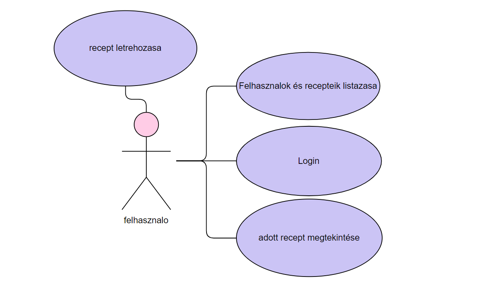

## Bodri-Bakery

## Projektötlet

  Az alapötlet egy Bodri Bakery nevű receptes oldal lenne.
Regisztráció nélkül a felhasználó megnézheti az addig feltöltött recepteket , regisztráció után pedig feltöltheti saját receptjeit  is.
A feltöltött recepteket be lehet sorolni kategóriákba gyerekbarát elkészítés  és időtartam  alapján.
A receptek lehetnek publikusak vagy privátak.

A moderátorok egy nem az oldalhoz illő, illetve nem szalonképes recepteket priváttá tehetnek, amely többé nem állítható vissza publikusra a felhasználó által.
Az adminisztrátor ezen felül adhat vagy elvehet moderátori jogot.

* Funkcionális követelmények:
 	* Regisztráció
 	* Publikus receptek listázása
 	* Receptek közötti keresés(név és hozzávaló alapján)
 	* Találatok rendezése
 	* Felhasználók listázása
 	
 	* A receptek értékeléseinek megtekintése
 	* Kulcsszavakhoz tartozó receptek listázása
  * Tagok által elérhető funkciók:
 	 * Saját receptek böngészése
 	 * Receptek létrehozása, módosítása, törlése
 	 * Egy recept lehet publikus vagy privát
 	* Recepthez tartozhat:
      * név
      * hozzávalók
      * leírás      
 	* A receptek lehetnek publikusak vagy privátok 	
 * Moderátorok által elérhető funkciók:
 	* Nem szalonképes publikus receptek véglegesen priváttá állítása
* Adminisztrátor:
 	* Felhasználóknak moderátori jog adása
 	* Felhasználóktól moderátori jog elvétele
* Nem funkcionális elvárások

* Felhasználóbarát, egyszerű, letisztult felület
 	* Keresési eredmények gyors megjelenítése
 	* Jelszavas azonosítás, jelszavak biztonságos tárolása
 	* Privát receptek biztonságos elrejtése a látogatók elől
* Szakterületi fogalomjegyzék
 	* recept: egy édes vagy sós sütemény elkészítésének a menetét leíró jegyzet
* Kliensoldali szolgáltatások:
	* bejelentkezes
	* felhasználó látja mely felhasználókhoz milyen recptek tartoznak
	* bármely felhasználó receptjét meg tudja tekinteni
	* képes receptet létrehozni így egy helye össze tudja gyűjteni receptjeit :D

* IDE: IntelliJ,Visual Studio Code	
	* GitHub-ról töltsük le a frontendet és a backendet
	* frontendet- visual studio code segítségével fordítsuk és futtassuk
		* npm install
		* npm start
	* backendet- importoljuk be az InteliJ-be és fordítsuk és futtassuk
* Database: H2
* Használt technológiák:
	* Java Spring Boot technológia 
	* MVC modell
	* REST API
	* H2
	* lombok
	* apache commons

## Könyvtárstruktúrák:
* controllers
  	* ReceiptController
  	* UserController
* entities
  	 * Ingredient
 	 * Receipt 	 
 	 * User
* repositories
 	 * ReceiptRepository
 	 * UserRepository
* security 	 
 	 * CustomBasicAuthenticationEntryPoint
 	 * MyUseDetailsService
 	 * WebSecurityConfig
* services
	
## Végpontok:
* GET/rec/{id} : adott recept lekerdezese
* GET/rec: felhasznalok és recepteik
* POST/new: új recept
* GET/users : userek lekérdezése
* POST/users/register  :  regisztrációs adatok elküldése
* POST/login : belépés adatok elküldése

## Diagrammok

* Felhasználói dokumentáció:
	* GitHubról letöltött bacendet és frontendet fordítsa és futtassa
		* a backendet IntelliJ segítségével
			* A projekt clean buildelése után futtatás a run gombbal
		* frontendet visual studio code segtségével
			* A terminálnál használja a npm install majd npm start parancsokat
	* Töltse be az oldalt Böngésző segítségével (localhost:4200)
	* Bejelenkezés felhasználónév és jelszó segítségével	
	* A receptnevek alatt található süteményekre kattintva kilistázhatjuk hogy az adott sütihez milyen hozzávalók kellenek, milyen nehéz elkészíteni és a leírását olvashatjuk
	* ha visszalépünk akkor az új recept gombra kattintva új receptet adhatunk hozzá a profilunkhoz
* Folyamatleírás:
	* Új recept létrehozásának folyamata: 
		* Authorizált folyamat, csupán fiókkal rendeklező, bejelentkezett felhasználók számára elérhető ez a funkció. Az egyes felhasználókat és az ő receptjeiket felsoroló oldalon tudunk új receptet létrehozni, mely a mentés után az éppen bejelentkezve lévő felhasználó receptlistájához fog hozzáadódni. A recept létrehozásakor 3 dolgot lehet beadni a rendszernek: 
			* Étel neve
			* Nehézségi fokozat
			* Leírás
Az új receptet menteni a Mentés gomb megnyomásával lehet.
